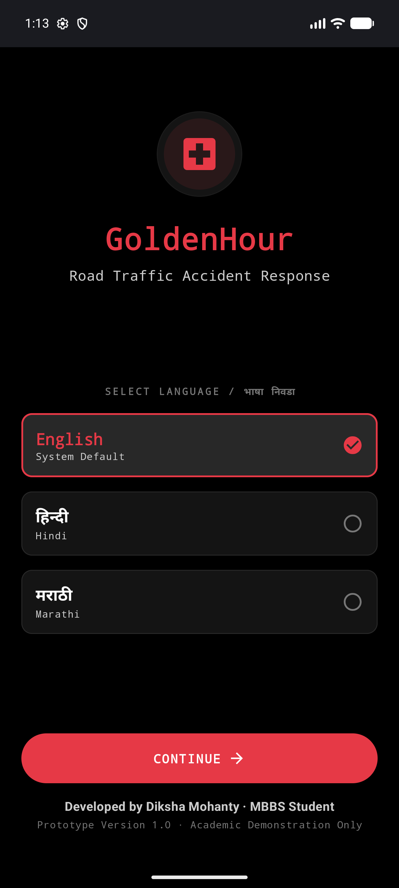
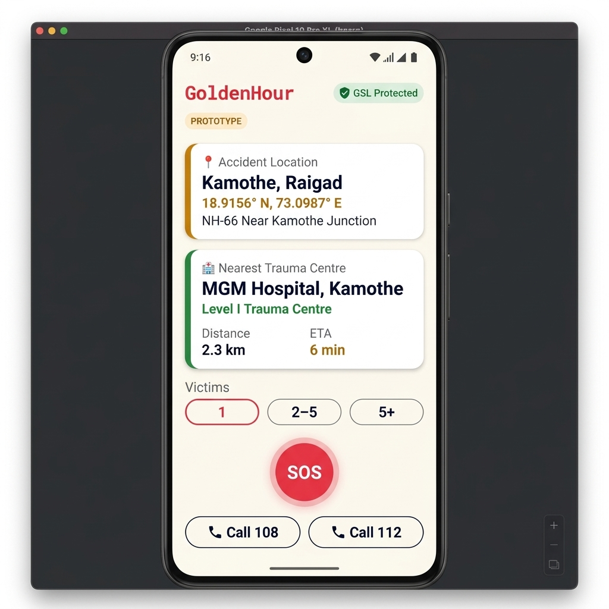
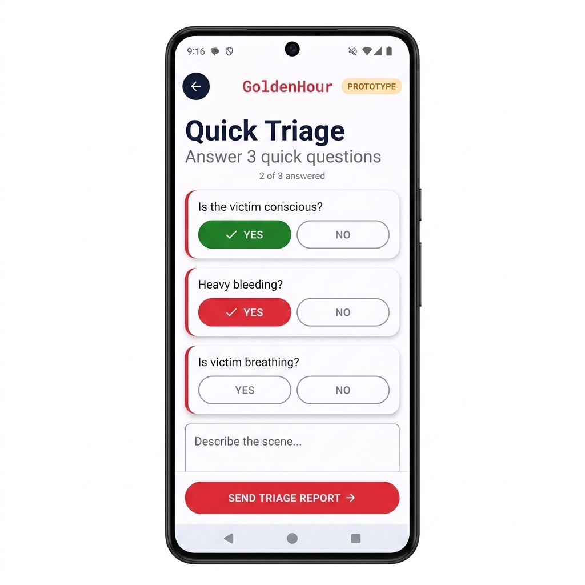
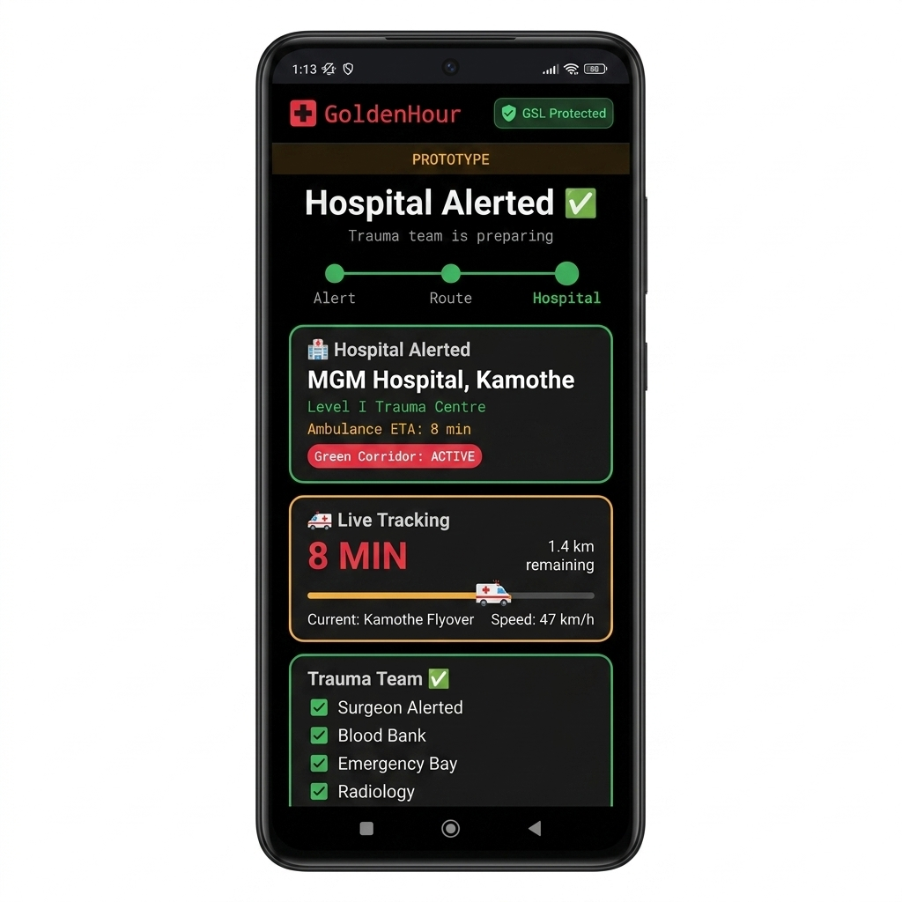

# 🚑 GoldenHour

> **Every second counts. GoldenHour helps bystanders save lives.**

GoldenHour is an Android emergency-response prototype that empowers Good Samaritans to rapidly alert hospitals, dispatch ambulances, and relay critical triage information — all within the critical "golden hour" window after an accident.

---

## 📱 Screenshots

| Language Selection | SOS Screen | Quick Triage | Hospital Dashboard |
| :---: | :---: | :---: | :---: |
|  |  |  |  |

---

## ✨ Features

### 🌐 Multi-Language Support

Launch the app in your preferred language. Language selection is persisted across the session, with all UI strings localised accordingly.

### 🛡️ Good Samaritan Law (GSL) Protection

Before the user activates an SOS, they are informed of their legal protections under India's Good Samaritan Law:

- **Legal immunity** — protected from civil and criminal liability
- **Financial protection** — no charges for providing assistance
- **Anonymity** — identity remains confidential throughout the process

### 🆘 SOS Activation

The main action screen allows a bystander to:

- View the **detected accident location** (place name, GPS coordinates, landmark)
- See the **nearest Level I Trauma Centre** and its ETA
- Select the **number of victims** (1 / 2–5 / 5+)
- Activate the **SOS alert** with a single pulsing button
- Directly call **108** (Ambulance) or **112** (Emergency) via the dialler

### 🩺 Quick Triage

Guided triage questionnaire that collects:

- Consciousness status
- Presence of heavy bleeding
- Breathing status
- Optional free-text scene report

Triage data is used downstream to pre-prepare the trauma team.

### 🔔 Alerting Screen

Confirmation that the hospital has been alerted and an ambulance dispatched, showing a live progress indicator.

### 🏥 Hospital Dashboard

A real-time command-centre view for the receiving hospital (and the bystander), showing:

| Section                    | Details                                                                                                                                                  |
| -------------------------- | -------------------------------------------------------------------------------------------------------------------------------------------------------- |
| **Hospital Card**          | Matched hospital name, trauma level, Green Corridor status                                                                                               |
| **Live Ambulance Tracking**| Real-time ETA, distance remaining, speed, current road location, and a step-by-step timeline (Dispatched → En Route → Near Scene → Arriving)            |
| **Trauma Team Checklist**  | Surgeon, blood bank, emergency bay, radiology, theatre, triage all confirmed ready                                                                       |
| **Triage Summary**         | Victim count, conscious/bleeding/breathing status, scene report                                                                                          |
| **AI Simulation Modules**  | Severity classification, trauma scoring, hospital allocation, and scene analysis — each with a confidence bar (clearly labelled as prototype/simulation) |

---

## 🏗️ Architecture

The project follows **MVVM + Repository** pattern with Jetpack Compose UI.

```text
app/src/main/java/com/goldenhour/
├── data/               # (data sources — expandable for real API/DB)
├── model/
│   └── Models.kt       # Domain models: EmergencySession, TriageData, HospitalInfo, AmbulanceTelemetry, …
├── repository/
│   └── EmergencyRepository.kt   # Single source of truth; simulates ambulance telemetry via Flow
├── ui/
│   ├── components/     # Reusable Compose components (PremiumCard, PulsingSosButton, LiveTrackingTimeline, …)
│   ├── navigation/
│   │   └── Screen.kt   # Sealed navigation routes
│   ├── screens/        # One file per screen
│   │   ├── LanguageSelectionScreen.kt
│   │   ├── GoodSamaritanScreen.kt
│   │   ├── SOSScreen.kt
│   │   ├── QuickTriageScreen.kt
│   │   ├── AlertingScreen.kt
│   │   └── HospitalDashboardScreen.kt
│   └── theme/
│       └── Color.kt    # Design token palette
├── utils/              # Helper utilities (string localisation, dialler intent, …)
├── viewmodel/          # ViewModels per screen/feature
├── GoldenHourApp.kt
└── MainActivity.kt
```

### Navigation Flow

```text
Language Selection → Good Samaritan Info → SOS Screen → Quick Triage → Alerting → Hospital Dashboard
                                                                                        ↓
                                                                                    Restart →
```

---

## 🛠️ Tech Stack

| Technology                    | Usage                                           |
| ----------------------------- | ----------------------------------------------- |
| **Kotlin**                    | Primary language                                |
| **Jetpack Compose**           | Declarative UI                                  |
| **Hilt (Dagger)**             | Dependency injection (`@Singleton`, `@Inject`)  |
| **Kotlin Coroutines & Flow**  | Async state + ambulance telemetry simulation    |
| **Material 3**                | Design system                                   |
| **ViewModel + StateFlow**     | Reactive state management                       |
| **Navigation Compose**        | Screen routing                                  |

---

## 🚀 Getting Started

### Prerequisites

- Android Studio Hedgehog (or newer)
- JDK 17+
- Android SDK 33+

### Clone & Run

```bash
git clone https://github.com/<your-org>/GoldenHour.git
cd GoldenHour
```

Open the project in Android Studio and run on a device or emulator (API 26+).

Or via command line:

```bash
./gradlew assembleDebug
adb install app/build/outputs/apk/debug/app-debug.apk
```

---

## ⚠️ Prototype Notice

GoldenHour is currently a **UI/UX prototype**. The following are simulated:

- GPS location detection (hardcoded to Kamothe, Raigad)
- Hospital matching and Green Corridor activation
- Ambulance GPS telemetry (animated with `delay()` in `EmergencyRepository`)
- AI severity classification, trauma scoring, and scene analysis modules

Real integrations (mapping APIs, hospital backend, AI inference) are on the roadmap.

---

## 🗺️ Roadmap

- [ ] Real GPS location detection
- [ ] Live hospital capacity API integration
- [ ] Actual AI-based triage severity scoring (on-device ML)
- [ ] Push notifications for hospital staff
- [ ] Multi-language expansion beyond current locales
- [ ] Offline-first mode with background sync

---

## 📄 License

This project is for demonstration and research purposes. See `LICENSE` for details.

---

*Built with ❤️ to help save lives in the golden hour.*
